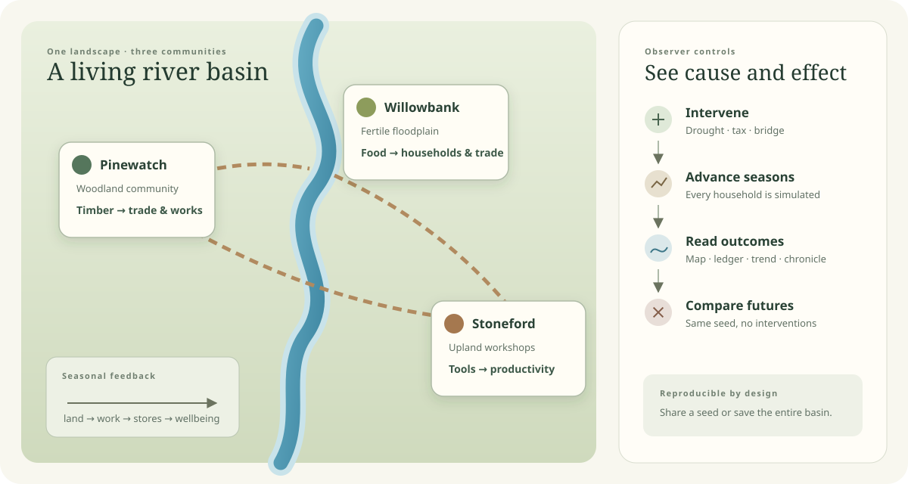
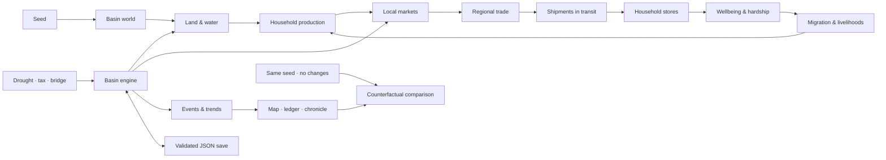

# Tiny Civilization

An observer-driven simulation of three communities sharing one river basin.
Households farm, cut timber, make tools, trade, migrate, and react to changes in
land and policy. You shape conditions, then watch the consequences emerge.

[](https://github.com/georgosgeorgos/tiny-civilization/actions/workflows/check.yml)



## What you can observe

- A deterministic 48 × 36 basin with elevation, drainage, moisture, fertility,
  forest cover, a continuous river, and terrain-aware trade routes.
- Roughly one hundred persistent households with material stocks, coin,
  livelihoods, wellbeing, hardship, and migration history.
- Local and regional markets where food, timber, and tools move through paid
  transactions and remain visible while in transit.
- Councils that collect tax, purchase materials, maintain common works, and can
  build bridges that shorten journeys and increase route capacity.
- A causal chronicle, settlement ledgers, map layers, and seasonal trends for
  food, population, wellbeing, trade, migration, prices, and forest cover.
- Counterfactual comparison against the same seed at the same season with no
  interventions.

## Run locally

Requires Node.js 22.6 or newer and a browser with WebGL 2 support.

```bash
npm install
npm run dev
```

Open the URL printed by Vite, usually <http://localhost:5173>. The app writes its
generated seed into the URL. Sharing that URL reproduces the same initial basin.

Use a fixed seed directly:

```text
http://localhost:5173/?seed=42
```

## Explore the basin

| Area | What it shows | What you can change |
| --- | --- | --- |
| 3D map | River, settlements, routes, cargo, fertility, and forest cover | Orbit, zoom, recenter, and switch map layers |
| Settlement ledger | Population, wellbeing, council trust, stores, flows, prices, and livelihoods | Select a settlement and change its sales tax |
| Public works | Treasury, bridge status, route time, and carrying capacity | Commission a bridge |
| Timeline | Current year, season, rainfall state, food, population, wellbeing, trade, migration, prices, and forest history | Pause, change pace, choose a measure, or advance one or ten years |
| Experiment controls | Current history versus an untouched run | Introduce a two-year drought or compare with no changes |
| Chronicle | Trade, migration, work, weather, policy, and livelihood events | Expand **Why?** to inspect recorded causes |

Use **Save** to download the complete basin as JSON. **Load** validates and
restores households, cargo, ecology, public works, interventions, and history so
the simulation can continue exactly.

## How the simulation fits together



Each simulated season follows a fixed sequence:

1. Deliver cargo whose route time has elapsed.
2. Produce goods and consume household food.
3. Clear local markets and fund public works.
4. Regenerate or degrade forest, fertility, and moisture.
5. Rebuild routes, dispatch regional trade, and move households under sustained
   hardship.
6. Record aggregate observations and causal events for the interface.

## Reproducibility

The basin is deterministic for the same seed, actions, and step schedule. Save
files contain the authoritative state and survive JSON serialization. The app
retains the latest 160 seasonal observations, 120 causal events, and 80
interventions.

The counterfactual comparison starts a fresh engine with the same seed and runs
it to the current season without interventions. It measures the combined effect
of the changed history; it does not isolate one policy when several interventions
were made.

## Project structure

| Path | Responsibility |
| --- | --- |
| `src/main.ts` | Selects the basin by default and lazy-loads the earlier sandbox |
| `src/basin/world.ts` | Terrain, drainage, settlement placement, and least-cost routes |
| `src/basin/engine.ts` | Households, markets, ecology, trade, migration, public works, and saves |
| `src/basin/view.ts` | Three.js terrain, routes, settlements, cargo, and map layers |
| `src/basin/app.ts` | Observer interface, controls, comparison, trends, and file actions |
| `src/simulation/` | Render-free research engine used by the earlier world-scale sandbox |
| `src/game.ts` | Browser lifecycle for the earlier sandbox |

## Development

```bash
npm test         # deterministic engine and reliability tests
npm run build    # TypeScript checks and production bundle
npm run check    # complete test and build gate used by CI
npm run research # legacy-model branches, ensembles, and coupling ablations
npm run preview  # serve the production build locally
```

The production build is written to `dist/`. CI runs `npm ci` followed by
`npm run check` for pushes and pull requests.

## Earlier sandbox and research model

Open `?mode=legacy` to use the earlier world-scale sandbox. It includes
configurable origins and geographies, written council directives, deep-time
projection, cultural lineages, institutions, diplomacy, and a broader Three.js
world view.

Legacy research checkpoints preserve random-generator state, cellular ecology,
and fractional time. Model version `research-foundation-2` differs from older
checkpoints. Its long-horizon balance diagnostic still reports six unmet food
and disease expectations, so both engines should be treated as exploratory
models rather than calibrated historical or economic predictions.

## Next directions

- Add browser-level interaction, accessibility, and responsive-layout tests.
- Model upstream water use, shared reserves, route disruption, and agreements.
- Add intervention-by-intervention counterfactual attribution.
- Reduce the initial Three.js bundle if load performance becomes limiting.
