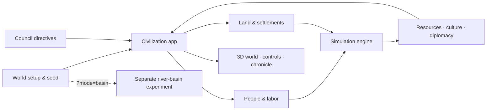
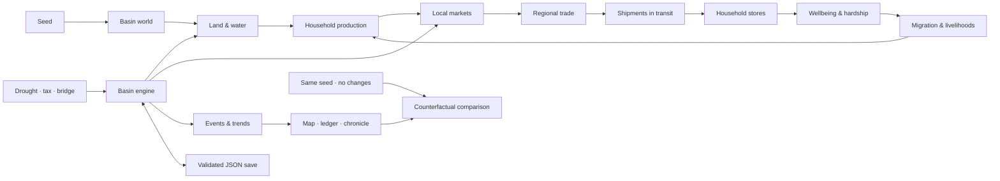

# Tiny Civilization

An observer-driven civilization simulation. Start with a camp, farming village,
city, or space habitat, set the council's priorities, and watch people build,
raise children, trade, migrate, learn, and respond to changing land and weather.

[](https://github.com/georgosgeorgos/tiny-civilization/actions/workflows/check.yml)



The default app couples visible people and settlements to the research engine.
The basin experiment has its own households, economy, and save format.

## Run locally

Requires Node.js 22.6 or newer and a browser with WebGL 2 support.

```bash
npm install
npm run dev
```

Open the URL printed by Vite, usually <http://localhost:5173>. Use **New world**
to choose an origin, geography, starting stores, technology, and temperament.
A fixed starting world can be opened with `?seed=91&origin=farmers&speed=0`.
The seed reproduces initial conditions, not an evolved world or its interventions.

## Civilization mechanics

- People have actual ages. Children depend on the settlement until age 16;
  working adults staff workplaces, and elders retire at 65. Births require
  reproductive adults, food, and housing. New houses add room, not free adults.
- Labor follows local needs and available workers on each island. Food shortages
  shift workers toward food production; empty buildings do not produce goods.
- Councils build according to population and resources. Housing makes room for
  growth, while food production and specialist work compete for limited labor.
- Food scarcity causes losses in proportion to population and elapsed time.
  Aging, migration, neighboring societies, and settlement collapse change who
  lives in the world. Collapsed neighbors are not automatically refounded.
- Farming and extraction pressure the land. Fallow land and forests can recover;
  cultural effects are bounded so accumulated customs cannot destroy or restore
  an entire ecosystem instantly. Practices can be learned again after losses.
- Existing institutions, diplomacy, cultural lineages, and innovation continue
  alongside the economy and generations.

The model uses twelve simulation days per year. **+1 yr**, **+100 yr**, **+1000 yr**,
and **Run … years** advance the coupled world in quarter-day steps, including
people, buildings, and neighboring societies. **Stop run** interrupts at a step
boundary; a later run continues from that point. The page must remain open.
Rendering slows during long runs to leave time for the simulation.

Written council directives change priorities, such as securing food or favoring
trade. Very large written deep-time requests use a separate statistical
projection with fixed settlement inputs; that projection does not simulate
every person and building as the year controls do.

**Export chronicle** downloads research records and settlement-engine checkpoints.
It is not a complete save/load system for the visible world. Those checkpoints
preserve engine random state, cellular ecology, and fractional time. The model
version is `research-foundation-3`; ecological and demographic rules differ from
older runs. This is a simplified exploratory model, not a calibrated historical
prediction. Founding populations, household formation, and disease waves are
abstracted rather than detailed demographic or epidemiological models.

## Optional basin experiment

The separate three-community river-basin economy remains available at
`?mode=basin` (for example, <http://localhost:5173/?mode=basin&seed=42>).
It focuses on household stocks, paid trade, transport, taxes, and public works.
Its households keep fixed sizes, so use the default civilization for generations.
The following controls and portable saves apply only to the basin experiment.

### Basin setup and long runs

The basin starts paused. In **Set up a basin**, choose the seed, households per
settlement (12–100), starting food, crop yield, rainfall, and forest regrowth.
Click **Apply settings & start** to create and run that world. Applying settings
replaces the current world; download **Save** first if you want to keep it.
The seed URL reproduces terrain; use a save file to share custom parameters
and the evolved world together.

Use **Run for … years** for a longer run (up to 100,000 years per request), or
**Play** for continuous observation. Every season is simulated in small batches;
**Pause** interrupts a long run at a season boundary, and another run continues
from there. Comparisons also run in cancellable batches and use the same initial
parameters. Runtime depends on the number of households and years requested.

A browser checkpoint is written about every five seconds while progressing,
on pause, on completion, and when leaving the page. On your next visit, choose
**Resume browser checkpoint** in setup. There is one checkpoint per browser
origin; starting another basin replaces it. **Save** and **Load** provide portable
JSON copies. If browser storage is unavailable, the checkpoint status tells you
to save manually. The simulation does not run while the page is closed or your
device sleeps; background tabs may run more slowly.

Select **Whole history** to see a bounded, progressively coarser overview of the
entire run, or **Recent seasons** for detail. The overview samples observations,
not averages, and can miss brief events. Older saves start building that overview
when resumed. Households currently keep their original sizes: long runs model
economic and ecological change, not births, deaths, or generations.

### Basin controls

| Area | What it shows | What you can change |
| --- | --- | --- |
| 3D map | River, settlements, routes, cargo, fertility, and forest cover | Orbit, zoom, recenter, and switch map layers |
| Settlement ledger | Population, wellbeing, council trust, stores, flows, prices, and livelihoods | Select a settlement and change its sales tax |
| Public works | Treasury, bridge status, route time, and carrying capacity | Commission a bridge |
| Timeline | Current year, season, rainfall state, food, population, wellbeing, trade, migration, prices, and forest history | Pause, change pace, choose a measure, or advance one or ten years |
| Experiment controls | Current history versus an untouched run | Introduce a two-year drought or compare with no changes |
| Chronicle | Trade, migration, work, weather, policy, and livelihood events | Expand **Why?** to inspect recorded causes |

Use **Save** to download the complete basin as JSON. **Load** validates and
restores households, cargo, ecology, public works, interventions, and history so
the simulation can continue exactly.

### Basin model

[Illustrated basin overview](docs/basin-overview.svg)



Each simulated season follows a fixed sequence:

1. Deliver cargo whose route time has elapsed.
2. Produce goods and consume household food.
3. Clear local markets and fund public works.
4. Regenerate or degrade forest, fertility, and moisture.
5. Rebuild routes, dispatch regional trade, and move households under sustained
   hardship.
6. Record aggregate observations and causal events for the interface.

### Basin reproducibility

The basin is deterministic for the same seed, actions, and step schedule. Save
files contain the authoritative state and survive JSON serialization. The app
retains the latest 160 seasonal observations, 120 causal events, and 80
interventions, plus at most 512 long-term observations.

The counterfactual comparison starts a fresh engine with the same seed and parameters and runs
it to the current season without interventions. It measures the combined effect
of the changed history; it does not isolate one policy when several interventions
were made.

## Project structure

| Path | Responsibility |
| --- | --- |
| `src/main.ts` | Selects the default civilization or the optional basin |
| `src/civilization-app.ts` and `src/civilization.html` | Set up the default app and its interface |
| `src/game.ts` | Visible world, people, councils, settlements, and browser lifecycle |
| `src/population.ts` | Births, aging mortality, and food-shortage losses |
| `src/simulation/labor.ts` | Assigns available adults to actual workplaces |
| `src/simulation/world-run.ts` | Cancellable advancement of the coupled world |
| `src/simulation/` | Settlement ecology, culture, institutions, and research engine |
| `src/basin/` | Separate household and river-basin experiment |
| `docs/research/` | Design proposals, technical specs, and review notes |

The [research document index](docs/research/README.md) distinguishes proposals
from current behavior; use this README and the code for the running model.

## Development

```bash
npm test         # engine, civilization, and reliability tests
npm run build    # TypeScript checks and production bundle
npm run check    # complete test and build gate used by CI
npm run research # settlement-model branches, ensembles, and coupling ablations
npm run preview  # serve the production build locally
```

The production build is written to `dist/`. CI runs `npm ci` followed by
`npm run check` for pushes and pull requests. The supplementary balance scenarios
can be run with `node --experimental-strip-types src/simulation/balance-test.ts`;
they are diagnostics, not evidence of historical calibration.
