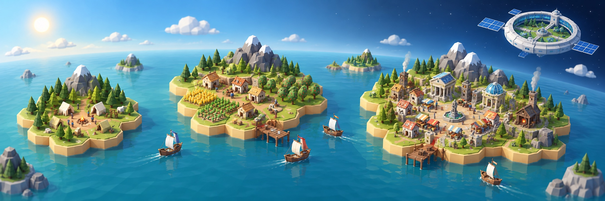
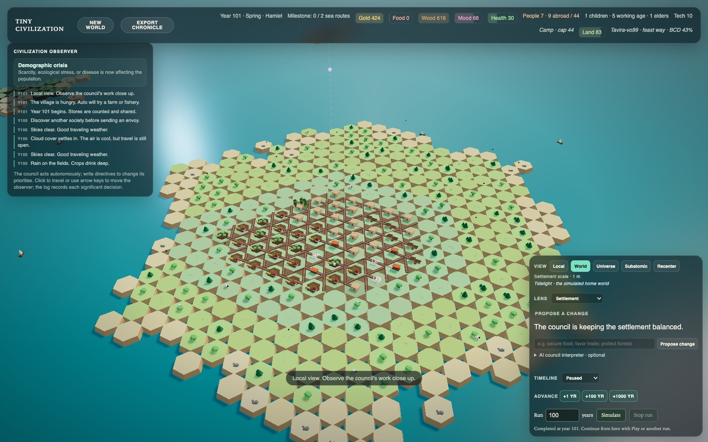

# Tiny Civilization

[](https://github.com/georgosgeorgos/tiny-civilization/actions/workflows/check.yml)



A civilization simulation you observe rather than command. Choose how a society
begins (a frontier camp, a farmers' village, an established city, or a
deep-space habitat), then watch its people build, raise children, trade, migrate,
learn, and respond to changing land and weather. You never place a building
yourself: you write proposals to the council and decide how far to skip ahead.

## Quick start

Requires Node.js 22.6 or newer and a browser with WebGL 2 support.

```bash
npm install
npm run dev
```

Open the URL printed by Vite, usually <http://localhost:5173>. A world starts
right away; **New world** begins a different one.

The world's seed is kept in the URL, so the same link reopens the same starting
world. For example, `?seed=91&origin=farmers&speed=0` opens a paused farmers'
village. A seed reproduces the initial conditions, not a world's later history
or your interventions.

## How to play

1. **Choose a beginning.** **New world** offers four origins, four geographies
   (continental, archipelago, shattered, or wild frontier), and a first aim:
   prosper, endure a winter, or connect distant settlements. **Fine tune this
   beginning** sets starting stores, technology, world temperament, visual
   character, and pace. **Surprise me** picks for you, and an optional world
   twist such as "a volatile, advanced frontier of strange ruins" adjusts the
   setup.
2. **Watch.** The council acts on its own. Drag to orbit, scroll to zoom, and
   click to travel. The **Local**, **World**, **Universe**, and **Subatomic**
   views change the scale, and the **Lens** menu follows the settlement, its
   working lands, a citizen, a neighbor society, or the regional network. The
   observer log records each significant decision, and its summary names what
   is shaping the settlement now.
3. **Propose a change.** Write what the council should prioritize, such as
   `secure food, then favor trade`. Local rules turn the words into ordered
   priorities: food, growth, wealth, culture, frontier, or balance. The same
   box sets the pace (`speed 2x`, `pause`).
4. **Skip ahead.** **+1 yr**, **+100 yr**, **+1000 yr**, and **Run … years**
   simulate every person, building, and neighboring society in quarter-day
   steps, with twelve simulation days per year. **Stop run** halts at a step
   boundary, and the next run continues from there. Keep the page open;
   rendering slows during long runs to leave time for the simulation.

Writing a jump such as `advance 1 million years` runs a statistical projection
instead, with the settlement's inputs held fixed. Unlike the year controls, it
does not simulate each person and building.



## What the model simulates

People and settlements on screen are coupled to the research engine in
`src/simulation/`.

- **People have actual ages.** Children depend on the settlement until age 16,
  working adults staff workplaces, and elders retire at 65. Births require
  reproductive adults, food, and housing. New houses add room, not free adults.
- **Labor follows local need.** Available workers on each island are assigned to
  actual workplaces. Food shortages shift workers toward food production, and
  empty buildings produce nothing.
- **Councils build for their population and resources.** Housing makes room for
  growth, while food production and specialist work compete for limited labor.
- **Scarcity costs lives.** Food shortages cause losses in proportion to
  population and elapsed time. Aging, migration, neighboring societies, and
  settlement collapse change who lives in the world. Collapsed neighbors are not
  automatically refounded.
- **The land keeps a record.** Farming and extraction wear it down; fallow land
  and forests can recover. Cultural effects are bounded, so accumulated customs
  cannot destroy or restore an entire ecosystem instantly, and practices lost in
  a crisis can be learned again.
- **Societies keep evolving.** Institutions, diplomacy, cultural lineages, and
  innovation change alongside the economy and generations.

This is a simplified exploratory model, not a calibrated historical prediction.
Founding populations, household formation, and disease waves are abstracted
rather than modeled in demographic or epidemiological detail.

## Optional AI council interpreter

Local rules only recognize keywords. For freer proposals, expand **AI council
interpreter** below the proposal box and paste your own
[OpenRouter API key](https://openrouter.ai/keys). Proposals are then sent with
a small settlement summary (year, people, housing, stores, and mood) directly
from your browser to OpenRouter, and the reply is mapped onto the same council
priorities.

- The default model is [DeepSeek V4.1 Flash](https://openrouter.ai/deepseek/deepseek-v4.1-flash)
  (`deepseek/deepseek-v4.1-flash`); change the model ID in the panel to use another.
- The key is not saved to browser storage or exported files. Clear the field to
  stop using it.
- If a request fails or times out, the app falls back to local rules.
- OpenRouter usage may incur charges.

## Exporting a chronicle

**Export chronicle** downloads the research records and settlement-engine
checkpoints, which preserve the engine's random state, cellular ecology, and
fractional time. It is a record of the run, not a complete save of the visible
world. Exports carry the model version `research-foundation-3`; its ecological
and demographic rules differ from older runs.

## Project structure

| Path | Responsibility |
| --- | --- |
| `src/main.ts` | Browser entry point |
| `src/civilization-app.ts` and `src/civilization.html` | App setup and interface |
| `src/game.ts` | Visible world, people, councils, settlements, and browser lifecycle |
| `src/population.ts` | Births, aging mortality, and food-shortage losses |
| `src/directive.ts` and `src/openrouter.ts` | Local proposal rules and the optional AI interpreter |
| `src/simulation/labor.ts` | Assigns available adults to actual workplaces |
| `src/simulation/world-run.ts` | Cancellable advancement of the coupled world |
| `src/simulation/` | Settlement ecology, culture, institutions, and research engine |
| `docs/research/` | Design proposals, technical specs, and review notes |

The [research document index](docs/research/README.md) separates proposals from
current behavior; use this README and the code for the running model.

## Development

```bash
npm test         # engine, civilization, and reliability tests
npm run build    # TypeScript checks and production bundle
npm run check    # complete test and build gate used by CI
npm run research # settlement-model branches, ensembles, and coupling ablations
npm run preview  # serve the production build locally
```

The production build is written to `dist/`. CI runs `npm ci` followed by
`npm run check` on pushes and pull requests. Supplementary balance scenarios run
with `node --experimental-strip-types src/simulation/balance-test.ts`; they are
diagnostics, not evidence of historical calibration.
